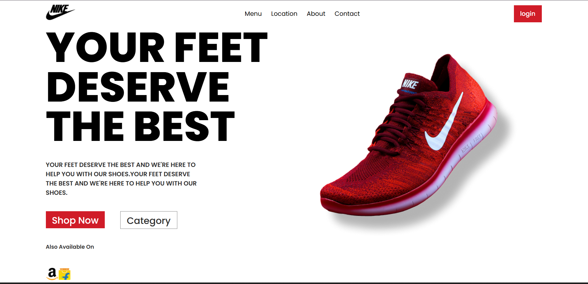

# 👟 Nike Landing Page UI (React.js)

A modern **Nike shoes landing page UI** built using **React.js**.
This project focuses on creating a **clean, responsive, and visually appealing frontend interface** for a product landing page.

It demonstrates **component-based UI development using React**, along with modern styling and layout techniques.

---

## 🌐 Live Demo

🚀 **View Live Project:**
https://react-projects-fj7nmvy2u-shubhamgusain886-5745s-projects.vercel.app

---

## 📸 Project Preview



---

## ✨ Features

* 🎨 Modern Landing Page Design
* ⚡ Built with React.js
* 📱 Responsive UI Layout
* 🧩 Component-Based Architecture
* 🖼️ Product Showcase Section
* 🛒 Call-to-Action Buttons (Shop Now / Category)
* 🔗 Navigation Bar (Menu, Location, About, Contact)

---

## 🛠️ Tech Stack

| Technology           | Usage                       |
| -------------------- | --------------------------- |
| **React.js**         | Frontend UI Development     |
| **CSS3**             | Styling                     |
| **JavaScript (ES6)** | Functionality               |
| **Vite**             | Fast Development Build Tool |
| **Vercel**           | Deployment                  |

---

## 📂 Project Structure

```
react-project
│
├── public
├── src
│   ├── components
│   ├── App.jsx
│   ├── main.jsx
│
├── package.json
└── README.md
```

---

## ⚙️ Installation & Setup

Clone the repository

```
git clone https://github.com/Shubham0x1/REACT_Projects.git
```

Navigate to project folder

```
cd REACT_Projects
```

Install dependencies

```
npm install
```

Run the development server

```
npm run dev
```

Open in browser

```
http://localhost:5173
```

---

## 🎯 Purpose of This Project

This project was created to practice:

* React Component Structure
* Frontend UI Design
* Layout & Styling Techniques
* Deploying React Applications

---

## 🚀 Deployment

This project is deployed using **Vercel**.

Live URL:
https://react-projects-fj7nmvy2u-shubhamgusain886-5745s-projects.vercel.app

---

## 👨‍💻 Author

**Shubham Gusain**

🔗 GitHub:
https://github.com/Shubham0x1

---

## ⭐ Support

If you like this project, please consider **starring the repository** ⭐
It helps others discover the project and motivates further development.

---

💡 *More React projects coming soon...*
